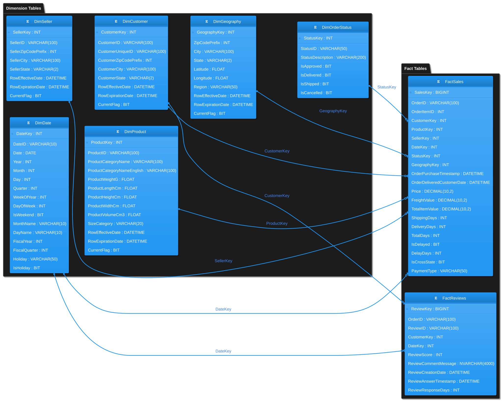
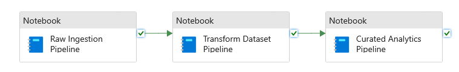

# Dual-Platform Sales ETL Pipeline

## Product vision

This repository presents a provider-neutral sales ETL pipeline with Azure and AWS implementations. Shared schemas, transformation rules, fixtures, expected outputs, and validation govern the behavior each platform implementation must preserve.

## Platform roadmap

| Platform | Status | Scope |
|---|---|---|
| [Azure](platforms/azure/README.md) | Locally verified; live-cloud validation pending | Synapse notebooks, orchestration templates, and SQL warehouse loaders |
| [AWS](platforms/aws/README.md) | Local S3 foundation implemented | LocalStack S3 bootstrap, raw ingestion, immutable manifests, and replay audit evidence |

The AWS implementation currently covers the Phase 3 local S3 foundation. Glue processing, orchestration, cloud infrastructure, and warehousing remain future phases.

## Shared data contract

The provider-neutral version 1 contract is split across the raw, processed, and curated catalogs in [`contracts/schemas/`](contracts/schemas/), with quality, grain, referential-integrity, snapshot, and replay policy in [`contracts/rules/`](contracts/rules/). Deterministic raw fixtures in [`contracts/fixtures/`](contracts/fixtures/) are validated against the versioned expectations in [`contracts/expected/`](contracts/expected/) by [`scripts/validate_contracts.py`](scripts/validate_contracts.py).

The sales fact has one row per order item. Reviews are linked to orders and customers, not products. These grains and transformation rules are shared requirements, not Azure-specific behavior.

## Azure implementation

The Azure implementation is the locally verified baseline; its platform guide documents the Synapse notebooks, orchestration templates, and warehouse loaders.

### Architecture

This diagram communicates the Azure ETL flow from source ingestion through processed and curated layers.


### Dimensional model

This diagram communicates the dimensions and facts produced for sales analytics.



### Aggregate datasets

This diagram communicates the aggregate datasets built from the curated model.


### Notebook pipeline

This diagram communicates the sequence of Azure notebooks in the pipeline.



## AWS implementation

The [AWS local guide](platforms/aws/README.md) documents how to start LocalStack S3, seed the nine contracted Olist inputs, inspect immutable manifests and audit evidence, verify status, and shut down the environment. LocalStack is not managed Amazon S3; no managed AWS service is claimed as executed.

## Local verification

Python 3.10 or newer is sufficient; Azure credentials are not required. Install the development dependencies, then run the phase gate:

```bash
python3 -m pip install -r requirements-dev.txt
make phase-2-test
```

This runs the existing baseline and documentation-link checks followed by provider-neutral contract validation. The validator can also be run directly:

```bash
python3 scripts/validate_contracts.py --fixture baseline
```

See the [baseline execution guide](platforms/azure/baseline.md) and [Azure baseline audit](platforms/azure/baseline.md) for current evidence and limitations.

## Repository layout

```text
contracts/              Provider-neutral schemas, rules, fixtures, and expected outputs
docs/                   Architecture, plans, and baseline evidence
platforms/azure/        Locally verified Azure implementation
platforms/aws/          AWS-local S3 package and runtime foundation
scripts/                Deterministic fixture and contract validators
tests/         Existing behavioral and repository-layout tests
```
