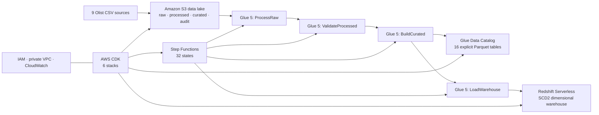
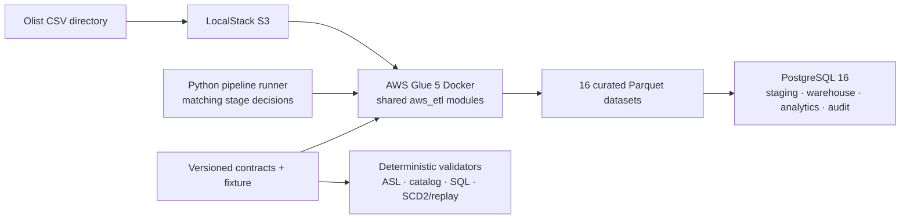

# AWS-First E-commerce Data Engineering Platform

An end-to-end batch data platform for the Olist e-commerce dataset, built around an Amazon S3 data lake, AWS Glue 5 and PySpark, Glue Data Catalog, a 32-state Step Functions workflow, Redshift Serverless with SCD Type 2 history, AWS CDK, least-privilege IAM, private networking, CloudWatch, and a PostgreSQL local warehouse.

> **Evidence statement:** the pipeline and PostgreSQL warehouse were executed locally, contracts and AWS behavior were validated deterministically, and all six AWS CDK stacks were synthesized—but no AWS resources were deployed.

## Architecture


```mermaid
flowchart LR
    SRC["9 Olist CSV sources"] --> S3["Amazon S3 data lake<br/>raw · processed · curated · audit"]
    S3 --> G1["Glue 5: ProcessRaw"]
    G1 --> G2["Glue 5: ValidateProcessed"]
    G2 --> G3["Glue 5: BuildCurated"]
    G3 --> CAT["Glue Data Catalog<br/>16 explicit Parquet tables"]
    G3 --> G4["Glue 5: LoadWarehouse"]
    G4 --> RS["Redshift Serverless<br/>SCD2 dimensional warehouse"]
    SF["Step Functions<br/>32 states"] --> G1
    SF --> G2
    SF --> G3
    SF --> G4
    CDK["AWS CDK<br/>6 stacks"] --> S3
    CDK --> CAT
    CDK --> SF
    CDK --> RS
    IAM["IAM · private VPC · CloudWatch"] --- CDK
```

The cloud design is split into six independently reviewable CDK stacks: Storage, Catalog, Warehouse, Processing, Orchestration, and Observability. Four Glue 5 jobs transform nine source datasets into six dimensions, two facts, and eight aggregates. The Standard Workflow coordinates replay classification, processing, quality decisions, curation, Redshift publication, immutable audit evidence, and terminal outcomes.

## Local execution architecture


```mermaid
flowchart LR
    CSV["Olist CSV directory"] --> LS["LocalStack S3"]
    LS --> GLUE["AWS Glue 5 Docker<br/>shared aws_etl modules"]
    GLUE --> CUR["16 curated Parquet datasets"]
    RUNNER["Python pipeline runner<br/>matching stage decisions"] --> GLUE
    CUR --> PG["PostgreSQL 16<br/>staging · warehouse · analytics · audit"]
    CONTRACTS["Versioned contracts + fixture"] --> GLUE
    CONTRACTS --> CHECKS["Deterministic validators<br/>ASL · catalog · SQL · SCD2/replay"]
```

LocalStack substitutes for S3, the official Glue 5 container runs PySpark, a Python runner mirrors orchestration decisions, and PostgreSQL exercises publication and replay behavior without cloud credentials.

## Engineering evidence

| Capability | Repository evidence | Evidence level |
|---|---|---|
| S3 data lake | Versioned raw objects, manifests, processed/curated Parquet writers, lifecycle-controlled CDK bucket | Executed locally; synthesized |
| Glue 5 / PySpark | Four cloud job entrypoints and shared `aws_etl` transformations | Executed locally; deterministically validated; synthesized |
| Glue Data Catalog | 16 explicit Parquet table definitions generated from curated contracts | Deterministically validated; synthesized |
| Step Functions | 32-state ASL workflow with explicit retry, replay, failure, and audit paths | Deterministically validated; synthesized |
| Redshift Serverless | Separate Redshift SQL, Data API loader, SCD2 publication procedure, private workgroup | Deterministically simulated; synthesized |
| PostgreSQL | Attempt-isolated staging and atomic dimensional publication | Executed locally |
| IAM and networking | Prefix-scoped roles, private `/24` VPC, three isolated subnets, S3 gateway endpoint, enhanced routing | Synthesized |
| CloudWatch and cost controls | Retained logs, actionless alarms, Glue concurrency/timeouts, 8–16 RPU and 40 RPU-hour monthly limit | Synthesized; not measured |

The full service-to-file matrix and evidence boundaries are in [AWS project evidence](platforms/aws/validation-evidence.md).

## Pipeline and warehouse flow

```text
9 CSV inputs
  -> immutable raw objects + manifests + submission audit
  -> explicit-schema cleansing, normalization, deduplication, rejected rows
  -> cross-dataset quality and referential-integrity gate
  -> 16 curated Parquet datasets (6 dimensions + 2 facts + 8 aggregates)
  -> attempt-isolated warehouse staging
  -> SCD2 dimension publication + event-time surrogate-key resolution
  -> facts + aggregates + completed registry + immutable audit evidence
```

Four dimensions—customer, product, seller, and geography—use tracked-attribute hashes and half-open effective intervals in the Redshift design. Identical completed replays are no-ops, changed evidence for a completed batch is a deterministic conflict, and failed attempts cannot create a completed publication record.

The sales fact grain is one row per order item. Reviews are linked to orders and customers, not products, so the review fact remains at its source review grain without inventing a product relationship.

## Deterministic fixture results

| Evidence | Result |
|---|---:|
| Source datasets | 9 |
| Curated datasets | 16 |
| Accepted sales fact rows / unique orders | 3 / 2 |
| Accepted review fact rows | 2 |
| Rejected rows | 2 |
| Gross input item value | $355.00 |
| Accepted curated sales total | $320.00 |
| Accepted freight total | $35.00 |

These are versioned sample-fixture results, not full Olist or managed-AWS measurements. See [`contracts/expected/baseline_snapshot.json`](contracts/expected/baseline_snapshot.json) for the complete expected evidence.

## Reproduce and validate

Python 3.11+, Node.js 22, Docker Engine with Compose v2, and Linux x86_64 are the supported toolchain. The deterministic, credential-free checks are:

```bash
python3 -m venv .venv
. .venv/bin/activate
python3 -m pip install -r requirements-dev.txt
python3 -m pip install -e platforms/aws
make aws-cdk-install
make project-validate
```

To execute the data pipeline and PostgreSQL warehouse locally with a complete Olist directory:

```bash
make aws-local-up
make aws-local-run DATASET_DIR=/absolute/path/to/olist BATCH_ID=project-run WAREHOUSE=1
make aws-postgres-validate BATCH_ID=project-run
make aws-local-status
make aws-postgres-down
make aws-local-down
```

The complete setup, stage-level commands, replay procedure, and cleanup behavior are in the [AWS implementation guide](platforms/aws/README.md). CI runs compilation, baseline/contracts, catalog metadata, state-machine, Redshift SQL, SCD2/replay simulation, TypeScript build, CDK synthesis without AWS credentials or deployment jobs.

## Repository map

```text
contracts/                         Schemas, quality/replay/SCD2 rules, fixture, expected evidence
platforms/aws/src/aws_etl/         Shared AWS-local/cloud transformation and publication modules
platforms/aws/entrypoints/         Four managed Glue jobs plus the local PostgreSQL loader
platforms/aws/catalog/             16 authoritative Glue table templates
platforms/aws/orchestration/       32-state Step Functions ASL definition
platforms/aws/sql/                 Separate PostgreSQL and Redshift warehouse SQL
platforms/aws/infrastructure/cdk/  Six-stack AWS architecture
scripts/                           Deterministic contract, catalog, SQL, simulation, hygiene validators
docs/                              Project evidence, warehouse design, baseline, and authoritative plan
platforms/azure/                   Preserved Azure Synapse reference implementation
```

## Scope and future work

The repository does not claim managed AWS execution, production deployment, measured AWS cost, or empirical Redshift optimization. Optional future work is a budget-capped sandbox deployment, managed fixture/full-data evidence, measured cost and duration, and query-plan/skew/scan validation before changing the provisional Redshift physical design.

The original Azure Synapse implementation remains available as a secondary preserved reference in [platforms/azure](platforms/azure/README.md); AWS is the primary implementation and project surface.
