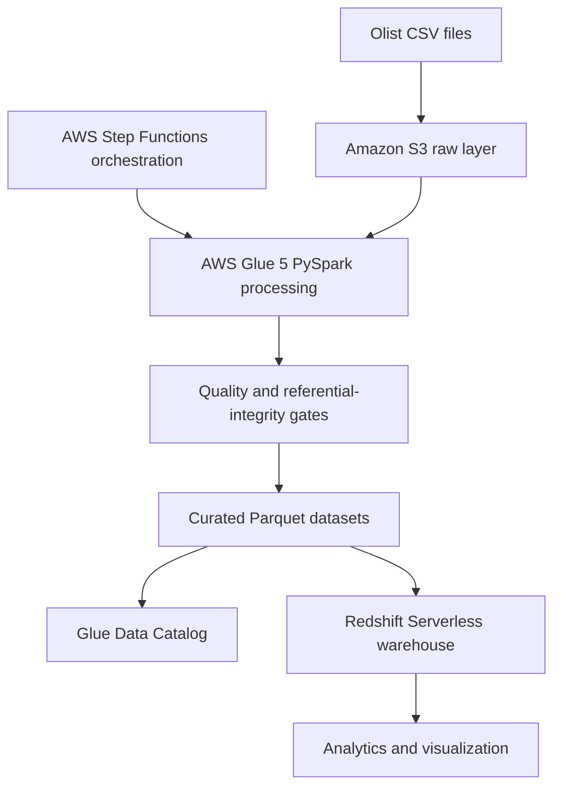
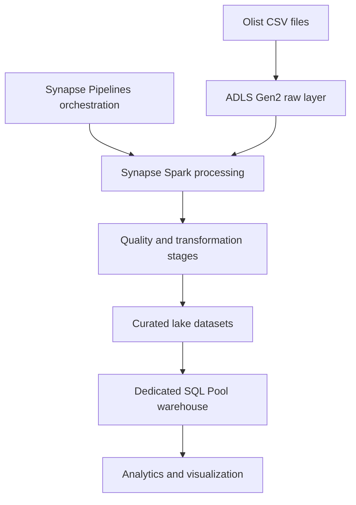

# Multi-Cloud E-commerce Data Engineering Pipeline

## Overview

This repository contains AWS and Azure implementations of an e-commerce data-engineering pipeline built from the Olist dataset. Both approaches target the same source contracts, transformation rules, quality expectations, dimensional model, and analytical outputs.

The pipelines turn transactional marketplace data into governed dimensions, facts, aggregates, and warehouse-ready analytical outputs.

## What the pipelines produce

- Nine source datasets
- Raw, processed, and curated stages
- Deterministic cleansing and deduplication
- Referential-integrity checks
- Six dimensions
- Two fact tables
- Eight aggregate datasets
- Analytical warehouse publication

## Cloud architectures

### AWS implementation


```mermaid
flowchart TD
    A[Olist CSV files] --> B[Amazon S3 raw layer]
    C[AWS Step Functions orchestration] --> D[AWS Glue 5 PySpark processing]
    B --> D
    D --> E[Quality and referential-integrity gates]
    E --> F[Curated Parquet datasets]
    F --> G[Glue Data Catalog]
    F --> H[Redshift Serverless warehouse]
    H --> I[Analytics and visualization]
```

The AWS path uses S3 and Glue for governed lake processing, Step Functions for orchestration, and Redshift Serverless as the analytical warehouse target.

[Explore the AWS implementation](platforms/aws/README.md)

### Azure implementation


```mermaid
flowchart TD
    A[Olist CSV files] --> B[ADLS Gen2 raw layer]
    C[Synapse Pipelines orchestration] --> D[Synapse Spark processing]
    B --> D
    D --> E[Quality and transformation stages]
    E --> F[Curated lake datasets]
    F --> G[Dedicated SQL Pool warehouse]
    G --> H[Analytics and visualization]
```

The Azure path uses ADLS Gen2 and Synapse Spark for governed lake processing, Synapse Pipelines for orchestration, and Dedicated SQL Pool as the analytical warehouse target.

[Explore the Azure implementation](platforms/azure/README.md)

## Shared data model

The shared model defines `fact_sales` at one row per order item and `fact_reviews` at one row per order and review pair, keyed by `(OrderID, ReviewID)`, with no product attribution.

Six dimensions describe customers, products, sellers, geography, dates, and order status. Eight aggregate outputs cover state and category sales, monthly trends, order status, cross-state commerce, seller performance, product size, and payment methods. See the versioned [schemas](contracts/schemas/README.md) and [quality, replay, and warehouse rules](contracts/rules/README.md) for the detailed contracts.

## Cross-cloud consistency

Both implementations target the same logical specification, but full operational interchangeability is not claimed until both managed pipelines are executed against the same inputs and their published outputs are compared end to end.

## Validation status

The AWS pipeline and PostgreSQL publication path were executed locally with LocalStack and the Glue 5 container. Replay, SCD2, publication, recovery, contracts, metadata, orchestration, and warehouse SQL were validated deterministically, and six AWS CDK stacks were synthesized without deploying managed AWS resources. The Azure guide preserves its Synapse implementation and verified baseline audit. A same-input, end-to-end comparison of both managed pipelines remains outstanding.

Detailed commands, evidence, limitations, security controls, observability, and future work remain in the [AWS guide](platforms/aws/README.md) and [Azure guide](platforms/azure/README.md).

## Repository structure

```text
contracts/         Shared schemas and behavioral rules
platforms/aws/     AWS pipeline, warehouse, infrastructure, and guide
platforms/azure/   Azure pipeline, warehouse, artifacts, and guide
scripts/           Contract, metadata, orchestration, and warehouse validation tools
tests/             Data contract and fixture behavior tests
docs/              Architecture, evidence, audits, and decisions
```
