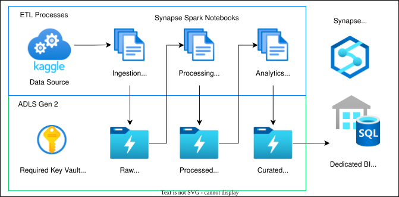
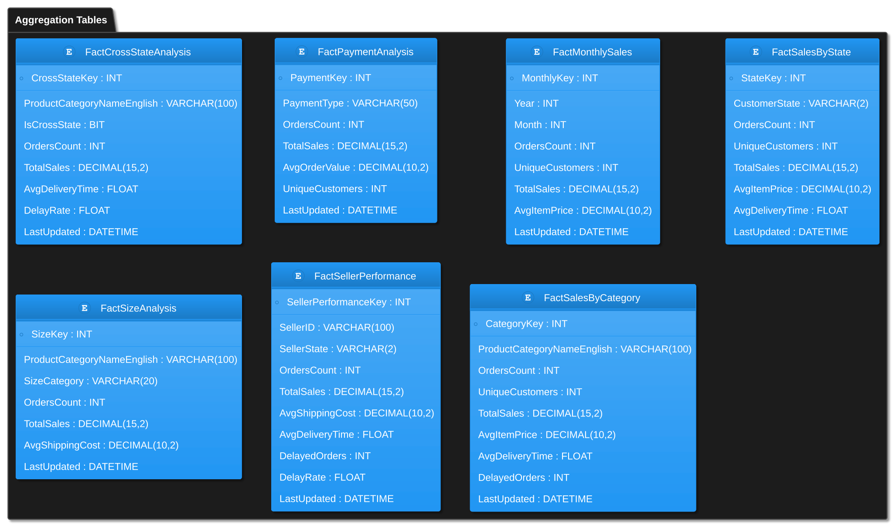

# E-Commerce Sales Analysis and Optimization using Azure Synapse Analytics

[Project overview](../../README.md) · [AWS implementation](../aws/README.md)

## Overview

This project implements a comprehensive Extract, Transform, and Load (ETL) pipeline using the services of Azure Synapse Analytics. The pipeline efficiently extracts data from the Brazilian e-commerce dataset (Olist), performs PySpark transformations through notebooks, and implements a three-layer data lakehouse architecture using Azure Data Lake Storage Gen2. The solution incorporates dimensional modeling techniques to create analytics-ready data structures stored for data lake querying and synced to a dedicated SQL pool for enterprise reporting. Through this approach, the pipeline delivers actionable sales insights that enhance inventory management, marketing optimization, and overall business decision-making processes.

## Dataset

The [dataset](https://www.kaggle.com/datasets/olistbr/brazilian-ecommerce) used in this project contains comprehensive information on Brazilian e-commerce transactions from Olist, with approximately 100,000 orders spanning 2016-2018. It includes detailed order information, product categories, customer demographics, shipping details, payment methods, and customer reviews, allowing for in-depth analysis of sales patterns, customer behavior, and operational efficiency in a real-world e-commerce environment.

  
  
<i>Figure 1: Overview of the Olist dataset schema showing entity relationships and table structures</i>

The dataset schema above illustrates the complex relationships between the various tables in the Olist dataset, including customers, orders, products, sellers, and reviews. Understanding these relationships is crucial for building an effective dimensional model.

## Prerequisites

1. **Microsoft Azure Subscription**
2. **Azure Data Lake Storage Gen2**: A hierarchical namespace-enabled storage solution optimized for analytics workloads, providing the foundation for the data lakehouse architecture with enhanced performance and cost-effectiveness.
3. **Azure Synapse Analytics**: An integrated analytics service that brings together enterprise data warehousing and big data analytics, with dedicated SQL pools for high-performance queries and serverless SQL pools for flexible data exploration.
4. **Azure Synapse Spark Pools**: Apache Spark runtime environment within Synapse for scalable data processing and machine learning workloads, supporting Python, Scala, and SQL.
5. **Azure Key Vault**: Secure storage for sensitive credentials and connection strings, enabling safe access to Kaggle APIs and data sources.
6. **Azure Synapse Pipelines**: Orchestration service for coordinating data movement and transformation activities, scheduling notebook execution, and implementing monitoring capabilities.

## Data Architecture

The project implements a three-layer data lakehouse architecture:

1. **Raw Layer**: Original, immutable data ingested from Kaggle stored in its native format
2. **Processed Layer**: Cleansed data with standardized structures, data type conversions, and quality validations
3. **Curated Layer**: Business-ready dimensional model with fact and dimension tables supporting analytics use cases

## Data Flow

The ETL pipeline consists of sequential stages that transform raw e-commerce data into analytics-ready insights:

1. **Extract Data**: Retrieve e-commerce data from Kaggle using secure API integration, landing raw files in the Data Lake's raw zone
2. **Process Data**: Transform raw data through Spark notebooks, implementing data quality checks, standardization, and feature engineering in the processed layer
3. **Curate Models**: Develop dimensional models (star schema) with fact and dimension tables optimized for analytical queries in the curated layer
4. **Load to SQL**: Populate dedicated SQL pools with the dimensional model for enterprise reporting and dashboard creation

  
  
<i>Figure 2: End-to-end ETL data flow showing movement from raw data through to analytics consumption</i>

The flow diagram above illustrates how data moves through the three architectural layers, with raw data being extracted from Kaggle, transformed through a series of processing steps, and ultimately surfaced as analytics-ready insights in a Dedicated SQL pool.

## Dimensional Model

The project implements a comprehensive star schema design for analytics optimization. The dimensional model consists of fact tables that capture business metrics and dimension tables that provide contextual attributes for analysis.

  
  
<i>Figure 3: Star schema dimensional model showing fact tables and their relationships with dimension tables</i>

The dimensional model diagram illustrates how the sales fact connects to customer, product, seller, geography, date, and order-status dimensions. The sales fact has one row per order item. The review fact has one row per order and review pair, keyed by (OrderID, ReviewID), with no product attribution.

The Azure baseline is a full-refresh snapshot. The dimension audit columns do not currently implement change detection or historical SCD Type 2 behavior. See [the baseline audit](../../platforms/azure/baseline.md) for the verified contracts and remaining limitations.

## Aggregation Tables

To enhance query performance and support common analytical patterns, the pipeline creates pre-aggregated tables that summarize data at various levels of granularity:

  
  
<i>Figure 4: Aggregation table structure showing summarized data for common analytical scenarios</i>

These aggregation tables provide pre-computed metrics for geographic analysis, temporal trends, product category performance, and seller effectiveness. Materializing these common aggregations reduces repeated aggregation work for dashboards and reports while reducing computational load on the analytical systems.

## Notebook Pipeline

The transformation logic is implemented through a sequence of PySpark notebooks in Azure Synapse Analytics. Each notebook handles specific aspects of the data processing pipeline:

  
  
<i>Figure 5: Sequential execution flow of Synapse notebooks showing transformation stages and dependencies</i>

This pipeline diagram shows the logical flow and dependencies between notebooks, illustrating how data progresses from initial extraction through transformation stages to final analytical outputs. The modular design allows for isolated testing, reusability, and maintenance of individual transformation components.

The notebook pipeline implements:
- Data extraction and initial validation
- Schema standardization and data cleansing
- Feature engineering and enrichment
- Dimensional model creation
- Analytics view generation

## Analysis

In this project, we conduct a comprehensive analysis of Brazilian e-commerce sales data using dimensional modeling techniques. Our analysis leverages the star schema design to explore key analytical dimensions that provide actionable insights across different aspects of the e-commerce business.

### Analysis #1: Geographic Sales Distribution

This [analysis](historical-artifacts/csvs/agg_sales_by_state) provides order count, unique-customer count, item revenue, average item price, and average delivery time by customer state.

### Analysis #2: Product Category Performance

This [analysis](historical-artifacts/csvs/agg_sales_by_category) provides order count, unique-customer count, item revenue, average item price, average delivery time, and delayed-order count by product category.

### Analysis #3: Monthly Sales Trends

This [analysis](historical-artifacts/csvs/agg_monthly_sales) provides temporal insights into sales patterns across months and seasons. It includes metrics on monthly revenue, order volume, and average ticket value. The data helps identify seasonality, growth trends, and anomalies, enabling more effective sales forecasting, promotion planning, and inventory management.

### Analysis #4: Order Status Analysis

This [analysis](historical-artifacts/csvs/agg_order_status) provides order count, unique-customer count, and item revenue by product category and current order status. It does not model status-transition history.

### Analysis #5: Cross-State Commerce Analysis

This [analysis](historical-artifacts/csvs/agg_cross_state_analysis) investigates the patterns of interstate commerce, tracking orders where customers and sellers are in different states. It includes metrics on cross-state shipping volume, delivery times, and regional interconnections. The insights enable logistics optimization, shipping cost management, and strategic decisions about seller recruitment in underserved regions.

### Analysis #6: Seller Performance Metrics

This [analysis](historical-artifacts/csvs/agg_seller_performance) provides order count, item revenue, average freight cost, average delivery time, delayed-order count, and delay rate by seller. Review scores are not included.

### Analysis #7: Product Size Impact Analysis

This [analysis](historical-artifacts/csvs/agg_size_analysis) examines how product size attributes influence sales performance across categories. It tracks metrics on size-specific order volumes, revenue contribution, and customer preferences. The insights help optimize inventory stocking by size, inform product development decisions, and create more effective merchandising strategies that align with customer size preferences.

### Analysis #8: Representative Payment Method Analysis

The `payment_methods` output groups orders by a deterministic representative payment type selected by payment sequence and payment type. It attributes item-price sales measures to that representative type and does not allocate `payment_value` as item revenue.

## Dimensional Tables

The project creates a standard set of dimension tables to support the analytical models:

<table width="100%" border="1" style="font-size: 16px;">
  <tr>
    <th align="left">Dimension</th>
    <th align="left">Description</th>
  </tr>
  <tr>
    <td><a href="historical-artifacts/csvs/dim_customer">Customer Dimension</a></td>
    <td>Contains customer demographic information, location data, and customer segmentation attributes</td>
  </tr>
  <tr>
    <td><a href="historical-artifacts/csvs/dim_product">Product Dimension</a></td>
    <td>Stores product details including category hierarchies, physical attributes, and pricing information</td>
  </tr>
  <tr>
    <td><a href="historical-artifacts/csvs/dim_seller">Seller Dimension</a></td>
    <td>Includes seller profiles, performance metrics, and geographic location</td>
  </tr>
  <tr>
    <td><a href="historical-artifacts/csvs/dim_geography">Geography Dimension</a></td>
    <td>Maintains hierarchical location data with state, city, and postal code relationships</td>
  </tr>
  <tr>
    <td><a href="historical-artifacts/csvs/dim_date">Date Dimension</a></td>
    <td>Provides calendar-related attributes for time-based analysis</td>
  </tr>
  <tr>
    <td>Order Status Dimension</td>
    <td>Provides the current order-status labels used by sales and order-status analysis</td>
  </tr>
</table>

## Fact Tables

The core transaction data is stored in two primary fact tables:

<table width="100%" border="1" style="font-size: 16px;">
  <tr>
    <th align="left">Fact Table</th>
    <th align="left">Description</th>
  </tr>
  <tr>
    <td><a href="historical-artifacts/csvs/fact_sales">Sales Fact Table</a></td>
    <td>Contains one row per order item with business identifiers in Parquet and resolved surrogate keys in the SQL warehouse</td>
  </tr>
  <tr>
    <td><a href="historical-artifacts/csvs/fact_reviews">Reviews Fact Table</a></td>
    <td>Stores one row per order and review pair, keyed by (OrderID, ReviewID), with no product attribution</td>
  </tr>
</table>

These fact tables form the foundation of the dimensional model, connecting the "facts" of business events with the contextual dimensions that describe them.

## Future Enhancements

Potential extensions to this project include:
- Inclusion of interactive Fabric Power BI dashboards on descriptions
- Inclusion of Delta tables for BI Analysis
- Implementation of machine learning models for demand forecasting and customer segmentation
- Integration with real-time data sources for near-real-time analytics
- Implementation of automated alerting based on key performance indicators
